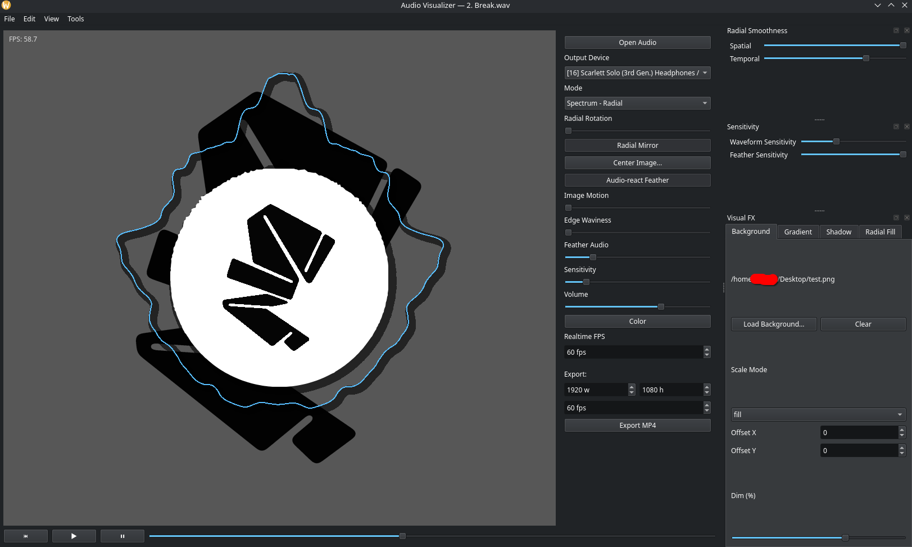

# Aurora — Real-Time Audio Visualizer

**Aurora** is a Python-based, cross-platform real-time audio visualizer with offline video exporting for Linux and macOS. (Windows support is still in testing).

It renders dynamic visual effects like waveforms, spectrums, and particle animations. It’s designed for content creators who want a customizable and performant visualization tool.

---

<p align="center">
  
</p>


## Features

- **Multiple Visual Modes**: Includes waveform, spectrum, and particle-based visualizations.
- **Tweakable parameters**: Customize the visualizer to your taste with controls for colors, images, movement, and audio reactivity.
- **Audio-reactive Elements**: Multiple parameters like color and central image feather react to your audio.
- **Exporting**: Record your visualizations with FFmpeg for high-quality videos.
- **Performance Optimized**: Uses PyQt and OpenGL for smooth rendering.
- **Audio formats**: Supports WAV, FLAC, MP3, OGG

---

## Installation

### 1. Clone the Repository
```bash
git clone https://github.com/yourusername/aurora.git
cd aurora
```

### 2. Create a Virtual Environment (optional)
```bash
python -m venv .venv
source .venv/bin/activate  # On macOS/Linux
.venv\Scripts\activate     # On Windows
```

### 3. Install Dependencies  
**Please run `install_requirements.py` before running `main.py`** to install all required dependencies.  
This script will ensure all required dependencies are installed with the correct versions.  

```bash
python install_requirements.py
```

---

## Known issues

- Windows support is currently untested but should theoretically work.
- Exporting with "Linear" waveform mode does not stretch the waveform all the way to the edge of the frame in some aspect ratios.
- Some image sizes result in visible clipping with the image feather.

---

## Usage

### Run the App
```bash
python main.py
```

When launched, you’ll see the main window with the selected theme and visualization mode.

---

## Requirements
| Package                   | Version  |
| ------------------------- | -------- |
| attrs                     | 25.3.0   |
| certifi                   | 2025.8.3 |
| cffi                      | 1.17.1   |
| charset-normalizer        | 3.4.2    |
| decorator                 | 4.4.2    |
| exporter                  | 0.0.4    |
| fastjsonschema            | 2.21.1   |
| glcontext                 | 3.0.0    |
| idna                      | 3.10     |
| imageio                   | 2.37.0   |
| imageio-ffmpeg            | 0.6.0    |
| imgkit                    | 1.2.3    |
| jsonschema                | 4.25.0   |
| jsonschema-specifications | 2025.4.1 |
| jupyter_core              | 5.8.1    |
| moderngl                  | 5.12.0   |
| moviepy                   | 1.0.3    |
| nbformat                  | 5.10.4   |
| numpy                     | 2.3.2    |
| pillow                    | 11.3.0   |
| pip                       | 25.2     |
| platformdirs              | 4.3.8    |
| proglog                   | 0.1.12   |
| pycparser                 | 2.22     |
| Pygments                  | 2.19.2   |
| PySide6                   | 6.9.1    |
| PySide6_Addons            | 6.9.1    |
| PySide6_Essentials        | 6.9.1    |
| referencing               | 0.36.2   |
| requests                  | 2.32.4   |
| rpds-py                   | 0.27.0   |
| scipy                     | 1.16.1   |
| setuptools                | 80.9.0   |
| shiboken6                 | 6.9.1    |
| six                       | 1.17.0   |
| sounddevice               | 0.5.2    |
| soundfile                 | 0.13.1   |
| tqdm                      | 4.67.1   |
| traitlets                 | 5.14.3   |
| urllib3                   | 2.5.0    |

## License
This software is licensed under the MIT No-Resale License © 2025 Strepto Sound,
You may use and modify it freely for personal and commercial purposes, but  
commercial redistribution of the software or derivative works is prohibited.  
See LICENSE.txt for full terms.
